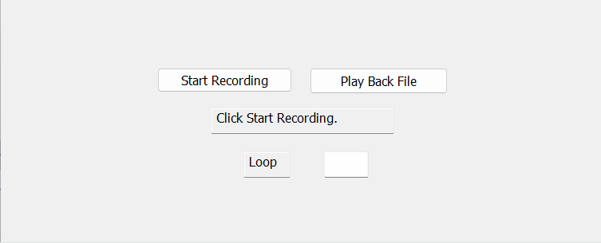

# AutoInputRecord 🎯🖱️⌨️  
A Windows desktop app (MFC-based) to **record and replay** mouse and keyboard input events. Useful for automation, repetitive tasks, UI testing, and demonstrations.

Includes a native DLL (`HookLib`) to inject system-level low-level hooks.

---

## ✨ Features

- 🔴 Record global mouse + keyboard input
- 💾 Save to and load from file
- ▶️ Replay with original timing and position
- 🔁 User-defined number of replays (1–10)
- 🧩 Modular architecture (main app + DLL)
- 📦 Lightweight, fast, and local

---

## 🎥 Demo

---

## 🛠️ Tech Stack

| Component      | Tech                |
|----------------|---------------------|
| Language       | C++                 |
| GUI Framework  | MFC (Microsoft Foundation Classes) |
| OS APIs        | Win32 (SendInput, Hooks) |
| Input Logging  | Low-Level Hook DLL  |
| Platform       | Windows (10/11)     |

---

## 🧠 Concepts Used

- System-wide input hooks (`WH_MOUSE_LL`, `WH_KEYBOARD_LL`)
- Input simulation (`SendInput`, `SetCursorPos`)
- Event timing using `Sleep` + timestamps
- Modular architecture using a DLL (HookLib)
- File I/O (plain text logs)
- MFC for user interface

---

## 🗂️ Project Structure

AutoInputRecord/
├── AutoInputRecord.sln # Visual Studio solution
├── AutoInputRecordDlg.cpp # Main UI logic
├── AutoInputRecord.rc # MFC resources (dialog, strings)
├── HookLib/ # Subproject (DLL for low-level hooks)
│ ├── HookLib.cpp
│ ├── HookLib.h
│ └── HookLib.vcxproj
├── demo/
│ └── AutoInputRecordDemo.gif # 📸 Replay demo (optional)
└── README.md

---

## 🚀 How to Build

1. Clone this repo
2. Open `AutoInputRecord.sln` in **Visual Studio**
3. Set **AutoInputRecord** as the Startup Project
4. Build both `AutoInputRecord` and `HookLib`
5. Make sure `HookLib.dll` is placed next to the main `.exe`
6. Run!

---

## 🧪 How It Works

1. **Record:**
   - Captures global input
   - Timestamps each event
   - Writes to a `.txt` file

2. **Replay:**
   - Reads the recorded file
   - Preserves input timing
   - Simulates events with `SendInput`
   - Accepts optional repeat count (default: 1)

---

## 📄 Sample Log File

MOUSE 513 300 400 1711953483123
KEY 65 DOWN 1711953484125
KEY 65 UP 1711953484225

---

## 📦 .gitignore

Build artifacts
*.obj
*.pdb
*.exe
*.log
*.idb
*.ipch
*.aps
*.ncb
*.sdf
*.suo
*.user
*.opensdf
*.VC.db
*.tlog
*.cache
*.ilk

Output directories
/Debug/
/Release/
/x64/Debug/
/x64/Release/

VS Code
.vscode/

